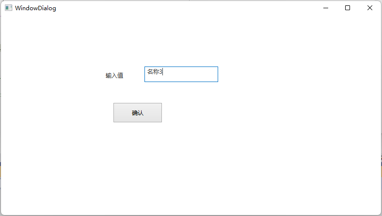
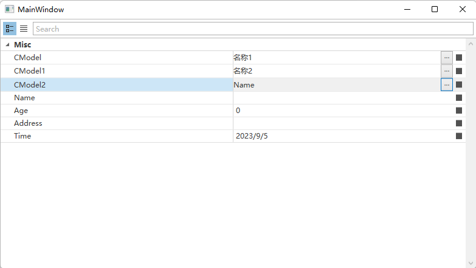

# DevExpress-CustomProperty

#### 介绍

DevExpress-PropertyGridControl 自定义属性弹出框,支持同类型属性多次设置

#### 软件架构

软件架构说明
NET5.0+WPF+DevExpress19.2

#### 使用说明

1.  编写 xaml 页面
2.  添加 Dialog 窗口
3.  Click 事件关联
4.  实现相关 Model 类

#### 软件界面

#### 仓库

- https://gitee.com/fengqixi_358/dev-express-custom-property.git
